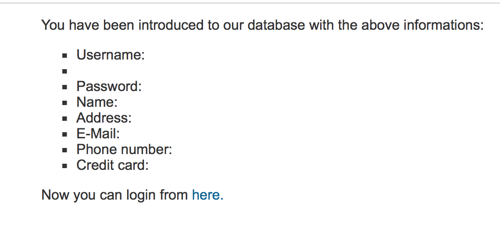

#Deliverable 5 -- Security Testing
###Yue Li (yul134)

###Testing site: http://testphp.vulnweb.com

###Vulnerability 1: Cross Site Scripting (Reflected) http://testphp.vulnweb.com/signup.php

	1. This vulnerability attacks integrity, which means the data of this site could be modified by unauthorized users.
	2. It is modification attack
	3. It is active
	4. Due to this vulnerability, unauthorized access might occur.
	5. Steps to exploit this vulnerability:
		(1). Go to sign up page.
		(2). Type "</li><li>" into username column.
		(3). Click "signup".
		Then we can see signup process will be successful.
	6. Steps to fix this vulnerability: 
		According to the analysis form OWASP ZAP: When an attacker gets a user's browser to execute his/her code, the code will run within the security context of the hosting web site. 
		To help mitigate XXS attacks, we could:
	    (1) Set the session cookie to be HttpOnly
	    (2) Use an "accept known good" input validation strategy
	    (3) Ensure that you perform input validation at well-defined interfaces within the application.
	
####Screenshots for this vulnerability:
Message from OWASP ZAP: 

1. signup page: 
2. sigup successfully: 
	
	
###Vulnerability 2: SQL Injection http://testphp.vulnweb.com/login.php

	1. This vulnerability attacks the confidentiality of the website, which means the data of this site could be modified by unauthorized users.
	2. It is interruption attack and modification attack
	3. It is active
	4. Business
	5. Steps to exploit this vulnerability:
		(1) Go to login page.
		(2) Type "test" as username.
		(3) Type "ZAP' OR '1'='1' -- " as password.
		(4) Click "login" button.
		Then we can see login is successful and user's profile is shown.
	6. Steps to fix this vulnerability:
		According to the analysis form OWASP ZAP: 
		To help mitigate XXS attacks, we could:
		(1) Do not trust client side input, even if there is client side validation in place.  
		(2) Use PreparedStatement or CallableStatement, with parameters passed by '?'

####Screenshots for this vulnerability:
Message from OWASP ZAP: 

1. login page: 
2. login successfully: 

###Vulnerability 3: SQL Injection -- MySQL http://testphp.vulnweb.com/signup.php
	1. This vulnerability attacks the confidentiality and integrity of the website, which means unauthorized users may read and write the data.
	2. It is interruption attack and modification attack and it is an active attack. 	
	3. It is active
	4. Business
	5. Steps to exploit this vulnerability:
		(1) Go to signup page.
		(2) Enter query "ZAP' UNION ALL select NULL -- " into username column.
		(3) Fill other columns.
		(4) Click "signup".
		Then the query will be executed and a message saying that the number of columns for the SELECT statement was incorrect.
	6. Steps to fix this vulnerability: 
		According to the analysis form OWASP ZAP: The vulnerability was detected by manipulating the parameter with an SQL UNION clause to cause a database error message to be returned and recognized.
		To help mitigate XXS attacks, we could: 
		(1) Do not trust client side input, even if there is client side validation in place.  
		(2) Minimize database access if possible and use parameterized queries
####Screenshots for this vulnerability:

Message from OWASP ZAP: 

1. signup page: 
2. error message: 
